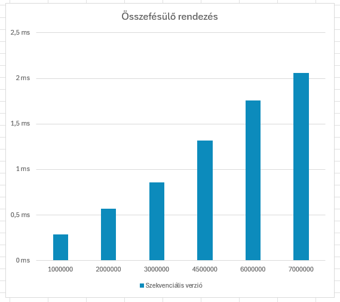
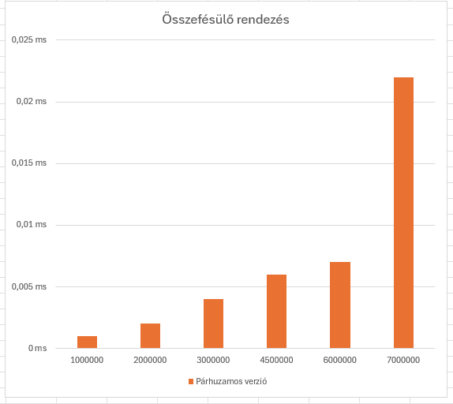
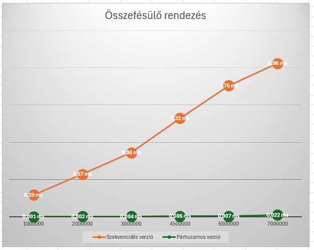
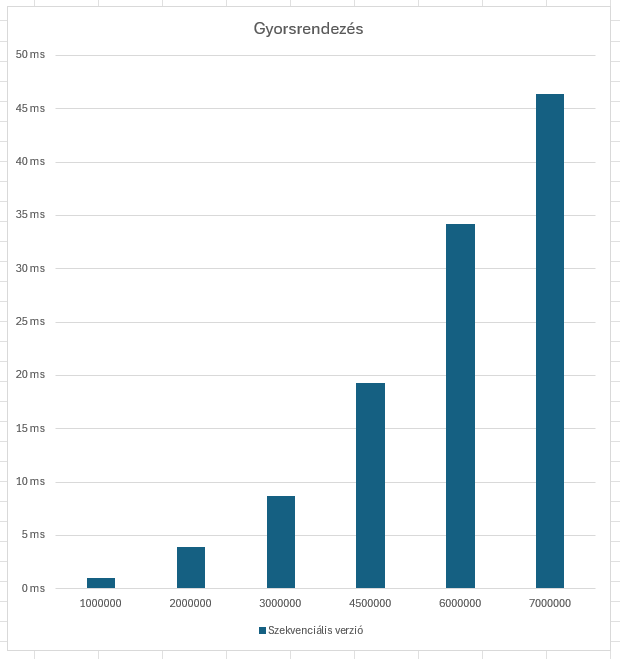
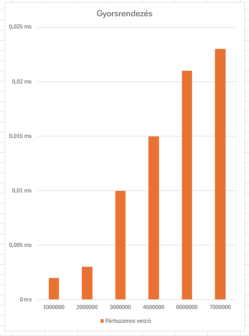
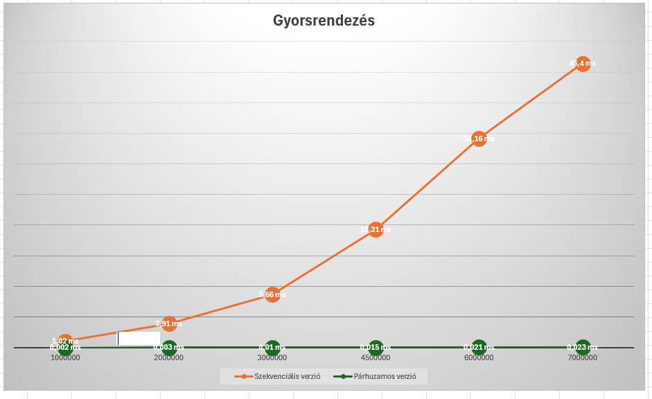

# Párhuzamos eszközök programozása

A Gyakorlatok mappában az órai munkám eredményei találhatóak.

A merge_vs_quick mappában a beadandó feladatom.

Gyorsrendezés és Összefésülő rendezés OpenCL-ben

A célom az volt, hogy implementáljam a gyors- illetve összefésülő rendezéseket mind szekvenciális és párhuzamosított esetben különböző (milliós nagyságú) tömbméretekkel  történő rendezéssel. A jegyzékek felépítését tekintve a kernel betöltését kiszerveztem két fájlba, amelyek az include (kernel_loader.h) és az src (kernel_loader.c) jegyzékben találhatóak meg. A kernels mappa a kernel kódot tartalmazza. És a főprogram is az src jegyzéken belül található. Ezenkívül a könnyebb fordítás érdekében létrehoztam makefile-kat is. A tömbméretek: 1000000, 2000000, 3000000, 4500000, 6000000, 7000000.

Összefésülő rendezés:

Szekvenciális eset:
    - A szekvenciális esetet az "src" jegyzéken belül a merge_sort.c fájl elején implementáltam le. Az összefésülő rendezés egy hatékony rendezési algoritmus, amely rekurzív módon felosztja a tömböt kisebb részekre, majd összefésüli ezeket a részeket rendezett sorrendben. A kód egy szekvenciális implementációt ad meg a rendezésnek. Az arr tömböt rendezem a low és high indexek közötti részen. Az algoritmus először rekurzívan felosztja a tömböt két részre, majd összefésüli ezeket a részeket. Az összefésülés során létrehoz két ideiglenes tömböt (left és right), majd összefésüli ezeket a fő tömbbe (arr). Végül felszabadítja az ideiglenes tömböket.

Párhuzamos eset:

- A párhuzamos esetet a "kernels" jegyzékben készítettem el, ahol több kernel több folyamatot hajt végre. Ezek az összefésülést és másolást végzik el az OpenCL környezetben.Az első kernel függvény, mergeToTemp, az összefésülést végzi el két résztömb között, és az eredményt egy ideiglenes tömbbe (temp) írja. A függvény paraméterei között szerepelnek az input tömb (arr), valamint a két résztömb határainak indexei (low1, high1, low2, high2). Az összefésülés eredménye az ideiglenes tömbben (temp) marad meg. A második kernel függvény, copyFromTemp, a temp ideiglenes tömb tartalmát másolja az eredeti tömbbe (arr) a megfelelő helyre. Ez a függvény segít visszailleszteni az összefésült részeket az eredeti tömbbe. A függvény paraméterei között szerepelnek az eredeti tömb (arr), az összefésült résztömbök határainak indexei (low1, high2), valamint az ideiglenes tömb (temp).

A merge_sort.c kód egy OpenCL alapú összefésülő rendezés implementációt valósít meg, amely összehasonlítja a szekvenciális és a párhuzamos rendezés futási idejét különböző méretű tömbökön.
A main függvény először inicializálja az OpenCL környezetet, létrehozva a platformot, az eszközt, a kontextust és a parancssorozatot. Ezután betölti a kernel fájlt, és létrehozza a két kernel függvényt: mergeToTemp és copyFromTemp. Ezután a fő ciklusban minden méretre (a sizes tömbben megadottak szerint) létrehoz egy véletlenszerűen inicializált tömböt, majd szekvenciálisan rendez vele. Ezt követően előkészíti az OpenCL számára a megfelelő memóriaterületeket, és átmásolja az adatokat a videókártya memóriájába. Ezután a program a párhuzamos rendezést hajtja végre a mergeToTemp és copyFromTemp kernel függvények segítségével. A futás időtartamát az időzítővel mérik, majd kiírják a szekvenciális és párhuzamos futás idejét a konzolra. Végül felszabadítjuk a dinamikusan foglalt memóriaterületeket, valamint az OpenCL erőforrásokat. Ez a ciklus minden méretre megismétlődik. Így a program segítségével összehasonlítható, hogy mennyi időt vesz igénybe az összefésülő rendezés szekvenciális és párhuzamos változata különböző méretű adathalmazokon.

 
 
 

Az ábrákon jól látható, hogy a párhuzamos eset jóval gyorsabban lefut mint a szekvenciális. Ez az eredmény azt mutatja, hogy az OpenCL segítségével kihasználhatjuk a párhuzamosítás előnyeit, és hatékonyabban dolgozhatunk a nagyobb adathalmazokkal. A párhuzamos összefésülő rendezés alkalmazása lehetővé teszi, hogy a számításokat a grafikus processzorokon végezzük el, amelyek sokszor nagyobb számítási kapacitással rendelkeznek, így az alkalmazások gyorsabbá és hatékonyabbá válnak. 

Gyorsrendezés:

Szekvenciális eset: 

A szekvenciális esetet ugyanúgy a c fájl elején implementáltam. A gyorsrendezés egy hatékony rendezési algoritmus, amely rekurzív módon felosztja a tömböt kisebb és nagyobb részekre a pivot elem alapján, majd az egyes részeket rendezetten összefésüli. A partition függvény kiválasztja a pivot elemet (általában az utolsó elemet), majd megosztja a tömböt úgy, hogy a kisebb elemek balra, a nagyobb elemek pedig jobbra kerüljenek a pivottól. A pi változó jelzi a pivottal végzett osztályozás után az alapvető algoritmus szerinti helyét. A quick_sort_seq függvény rekurzívan alkalmazza a gyorsrendezést a tömb különböző részeire. Először meghívja a partition függvényt, hogy meghatározza a pivot helyét, majd rekurzívan hívja önmagát a pivot előtti és utáni részt rendezve.

Párhuzamos eset:

A kernel kód három OpenCL kernel függvényt tartalmaz, amelyek egy párhuzamos gyorsrendezés algoritmust valósítanak meg. Az első kernel függvény, partition, meghatározza a pivottal végzett osztályozás utáni helyet. A második kernel függvény, quick_sort, egy verem alapú iteratív megközelítést alkalmaz a gyorsrendezésre. Az algoritmus használja a vermet az alproblémák (részletek) nyomon követésére, és párhuzamosan végzi el a rendezést. A kernel függvényben létrehozott stack változó egy vermet reprezentál, amelyen keresztül követi az aktuálisan feldolgozott részeket. Amikor az algoritmus feldolgozza egy részt, azonosítja a pivotot, majd ha szükséges, új részeket ad hozzá a veremhez a további feldolgozáshoz. A harmadik kernel függvény, merge, az összefésülést végzi el a párhuzamosan rendezett részek között. Ez a rész nem része a gyorsrendezés alapvető lépései közé, de a gyorsrendezés után szükséges, hogy rendezetté tegye az összes részt. A quicksort.c fájl elején implementáltam a szekvenciális változatát a gyorsrendezésnek. A main függvény betölti a kernel fájlt, inicializálja az OpenCL környezetet, majd egy ciklusban minden méretre elvégzi a párhuzamos gyorsrendezés futásidőmérését, majd kiírja a szekvenciális és párhuzamos futás idejét a konzolra. Végül felszabadítja az OpenCL erőforrásokat és a dinamikusan foglalt memóriaterületeket.

 
 
 