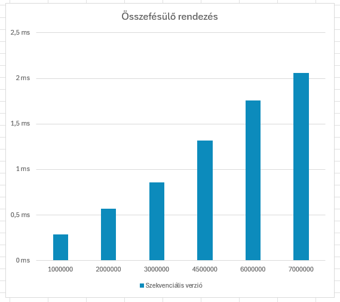

# Párhuzamos eszközök programozása

A Gyakorlatok mappában az órai munkám eredményei találhatóak.

A merge_vs_quick mappában a beadandó feladatom.

Gyorsrendezés és Összefésülő rendezés OpenCL-ben

A célom az volt, hogy implementáljam a gyors- illetve összefésülő rendezéseket mind szekvenciális és párhuzamosított esetben különböző tömbméretekkel történő rendezéssel. 

Összefésülő rendezés:

Szekvenciális eset:
    - A szekvenciális eseteket az "src" jegyzéken belül a quick_sort.c illetve merge_sort.c fájlok elején implementáltam le.
      Az összefésülő rendezés egy hatékony rendezési algoritmus, amely rekurzív módon felosztja a tömböt kisebb részekre, majd összefésüli ezeket a részeket rendezett sorrendben. A kód egy szekvenciális implementációt ad meg a merge sortnak. Az arr tömböt rendezem a low és high indexek közötti részen. Az algoritmus először rekurzívan felosztja a tömböt két részre, majd összefésüli ezeket a részeket. Az összefésülés során létrehoz két ideiglenes tömböt (left és right), majd összefésüli ezeket a fő tömbbe (arr). Végül felszabadítja az ideiglenes tömböket.

Párhuzamos eset:

    - A párhuzamos esetet mindkét esetben a "kernels" jegyzékben készítettem el, ahol több kernel több folyamatot hajt végre. Ezek az összefésülést és másolást végzik el az OpenCL környezetben.Az első kernel függvény, mergeToTemp, az összefésülést végzi el két résztömb között, és az eredményt egy ideiglenes tömbbe (temp) írja. A függvény paraméterei között szerepelnek az input tömb (arr), valamint a két résztömb határainak indexei (low1, high1, low2, high2). Az összefésülés eredménye az ideiglenes tömbben (temp) marad meg. A második kernel függvény, copyFromTemp, a temp ideiglenes tömb tartalmát másolja az eredeti tömbbe (arr) a megfelelő helyre. Ez a függvény segít visszailleszteni az összefésült részeket az eredeti tömbbe. A függvény paraméterei között szerepelnek az eredeti tömb (arr), az összefésült résztömbök határainak indexei (low1, high2), valamint az ideiglenes tömb (temp).

    A merge_sort.c kód egy OpenCL alapú összefésülő rendezés implementációt valósít meg, amely összehasonlítja a szekvenciális és a párhuzamos rendezés futási idejét különböző méretű tömbökön.
    A main függvény először inicializálja az OpenCL környezetet, létrehozva a platformot, az eszközt, a kontextust és a parancssorozatot. Ezután betölti a kernel fájlt, és létrehozza a két kernel függvényt: mergeToTemp és copyFromTemp. Ezután a fő ciklusban minden méretre (a sizes tömbben megadottak szerint) létrehoz egy véletlenszerűen inicializált tömböt, majd szekvenciálisan rendez vele. Ezt követően előkészíti az OpenCL számára a megfelelő memóriaterületeket, és átmásolja az adatokat a videókártya memóriájába. Ezután a program a párhuzamos rendezést hajtja végre a mergeToTemp és copyFromTemp kernel függvények segítségével. A futás időtartamát az időzítővel mérik, majd kiírják a szekvenciális és párhuzamos futás idejét a konzolra. Végül felszabadítjuk a dinamikusan foglalt memóriaterületeket, valamint az OpenCL erőforrásokat. Ez a ciklus minden méretre megismétlődik. Így a program segítségével összehasonlítható, hogy mennyi időt vesz igénybe az összefésülő rendezés szekvenciális és párhuzamos változata különböző méretű adathalmazokon.

