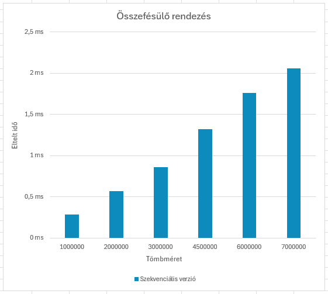
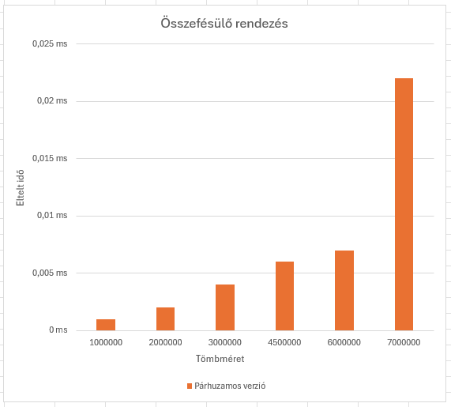
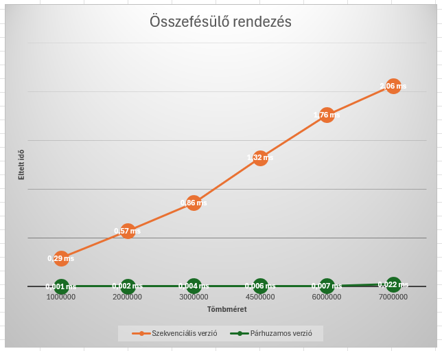
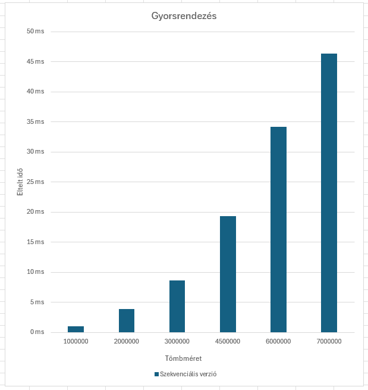
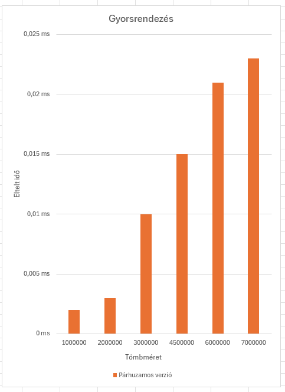
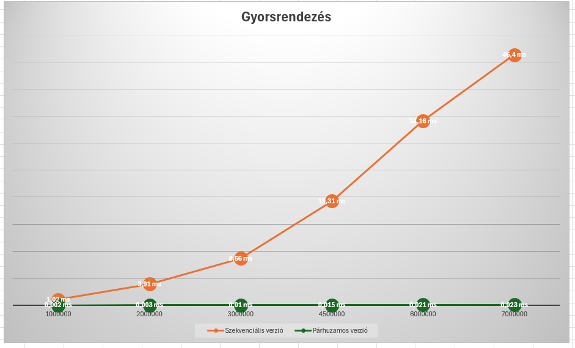

# Párhuzamos eszközök programozása

A `Gyakorlatok` mappában az órai munkáim eredményei találhatóak.

A `merge_vs_quick` mappában a beadandó feladatomhoz a forráskódok találhatóak.

A `docs` jegyzékben két almappa található:
- `images`: a dokumentációhoz szükséges képek
- `Futási idő`: az Excel fájlok a mérésekhez

## Gyorsrendezés és Összefésülő rendezés OpenCL-ben

Célom az volt, hogy implementáljam a gyors- illetve összefésülő rendezéseket mind szekvenciális, mind párhuzamosított esetben különböző (milliós nagyságú) tömbméretekkel történő rendezéssel. A jegyzékek felépítését tekintve a kernel betöltését kiszerveztem két fájlba, amelyek az `include` (`kernel_loader.h`) és az `src` (`kernel_loader.c`) jegyzékben találhatóak meg. A `kernels` mappa a kernel kódot tartalmazza. A főprogram az `src` jegyzéken belül található. Ezenkívül a könnyebb fordítás érdekében létrehoztam makefile-kat is. A tömbméretek: 1000000, 2000000, 3000000, 4500000, 6000000, 7000000.

### Összefésülő rendezés

#### Szekvenciális eset:

A szekvenciális esetet az `src/merge_sort.c` fájl elején implementáltam. Az összefésülő rendezés egy hatékony rendezési algoritmus, amely rekurzív módon felosztja a tömböt kisebb részekre, majd rendezetten összefésüli ezeket. Az algoritmus rekurzívan felosztja a tömböt két részre, majd összefésüli ezeket a részeket. Az összefésülés során létrehoz két ideiglenes tömböt (left és right), majd összefésüli ezeket a fő tömbbe (arr). Végül felszabadítja az ideiglenes tömböket.

#### Párhuzamos eset:

A párhuzamos esetet a `kernels` jegyzékben készítettem el. A kernel függvények több folyamatot hajtanak végre párhuzamosan az OpenCL környezetben. Az összefésülő rendezést és másolást végzik el. Az első kernel függvény, `mergeToTemp`, az összefésülést végzi el két résztömb között. A második kernel függvény, `copyFromTemp`, a temp ideiglenes tömb tartalmát másolja az eredeti tömbbe. 

A `merge_sort.c` kód egy OpenCL alapú összefésülő rendezés implementációt valósít meg, amely összehasonlítja a szekvenciális és a párhuzamos rendezés futási idejét különböző méretű tömbökön. A main függvény betölti a kernel fájlt, inicializálja az OpenCL környezetet, majd egy ciklusban minden méretre elvégzi a párhuzamos gyorsrendezés futásidőmérését, majd kiírja a szekvenciális és párhuzamos futás idejét a konzolra. Végül felszabadítja az OpenCL erőforrásokat és a dinamikusan foglalt memóriaterületeket.

 
 
 

Az ábrákon jól látható, hogy a párhuzamos eset jóval gyorsabban lefut, mint a szekvenciális. Ez az eredmény azt mutatja, hogy az OpenCL segítségével kihasználhatók a párhuzamosítás előnyei, és hatékonyabban dolgozhatunk nagyobb adathalmazokkal. A párhuzamos összefésülő rendezés alkalmazása lehetővé teszi, hogy a számításokat a grafikus processzorokon végezzük el, amelyek sokszor nagyobb számítási kapacitással rendelkeznek, így az alkalmazások gyorsabbá és hatékonyabbá válnak. 

### Gyorsrendezés

#### Szekvenciális eset:

A szekvenciális esetet az `src/quicksort.c` fájl elején implementáltam. A gyorsrendezés egy hatékony rendezési algoritmus, amely rekurzívan felosztja a tömböt kisebb és nagyobb részekre a pivot elem alapján, majd rendezetten összefésüli az egyes részeket. Az algoritmus először kiválasztja a pivot elemet, majd megosztja a tömböt úgy, hogy a kisebb elemek balra, a nagyobb elemek pedig jobbra kerüljenek a pivottól. Végül a quick_sort_seq függvény rekurzívan hívja önmagát a két részre.

#### Párhuzamos eset:

A kernel kód három OpenCL kernel függvényt tartalmaz, amelyek egy párhuzamos gyorsrendezés algoritmust valósítanak meg. Az első kernel függvény, partition, meghatározza a pivottal végzett osztályozás utáni helyet. A második kernel függvény, quick_sort, egy verem alapú iteratív megközelítést alkalmaz a gyorsrendezésre. A harmadik kernel függvény, merge, az összefésülést végzi el a párhuzamosan rendezett részek között. A main függvény betölti a kernel fájlt, inicializálja az OpenCL környezetet, majd egy ciklusban minden méretre elvégzi a párhuzamos gyorsrendezés futásidőmérését, majd kiírja a szekvenciális és párhuzamos futás idejét a konzolra. Végül felszabadítja az OpenCL erőforrásokat és a dinamikusan foglalt memóriaterületeket.

 
 

