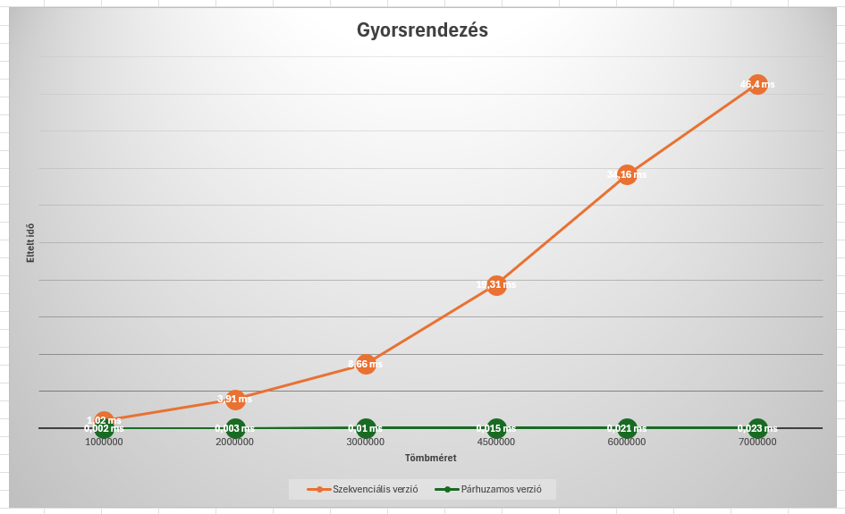

# Párhuzamos eszközök programozása

A `Gyakorlatok` mappában az órai munka eredményei találhatóak.

A `merge_vs_quick` mappában a beadandó feladatomhoz a forráskódok találhatóak.

A `docs` jegyzékben két almappa található:
- `images`: a dokumentációhoz szükséges képek
- `Futási idő`: az Excel fájl a mérésekhez

## Gyorsrendezés és Összefésülő rendezés OpenCL-ben

A párhuzamos méréseket RTX 2060 6GB GDDR6 Advanced PCIE GPU-n végeztem.
A szekvenciális méréseket Intel(R) Core(TM) i5-4690 CPU @ 3.50GHz processzoron futtattam. 
Az időméréseket az OpenCL események segítségével végeztem.

Paraméterek: A mérések során különböző méretű adathalmazokkal dolgoztam (például 1000000, 2000000, 3000000, 4500000, 6000000, 7000000 elemű tömbök).

A méréseket olyan környezetben végeztem, ahol nem futott más terhelő szoftver, és nem volt jelen olyan tényező, ami befolyásolhatta volna a GPU vagy CPU teljesítményét.

Célom az volt, hogy implementáljam a gyors- illetve összefésülő rendezéseket mind szekvenciális, mind párhuzamosított esetben különböző (milliós nagyságú) tömbméretekkel történő rendezéssel. A jegyzékek felépítését tekintve a kernel betöltését kiszerveztem két fájlba, amelyek az `include` (`kernel_loader.h`) és az `src` (`kernel_loader.c`) jegyzékben találhatóak meg. A `kernels` mappa a kernel kódot tartalmazza. A főprogram az `src` jegyzéken belül található. Ezenkívül a könnyebb fordítás érdekében létrehoztam makefile-t is.

### Összefésülő rendezés

#### Szekvenciális eset:

A szekvenciális esetet az `src/merge_sort.c` fájl elején implementáltam. Az összefésülő rendezés egy hatékony rendezési algoritmus, amely rekurzív módon felosztja a tömböt kisebb részekre, majd rendezetten összefésüli ezeket. Az összefésülés során létrehoz két ideiglenes tömböt (`left` és `right`), majd összefésüli ezeket a fő tömbbe (`arr`). Végül felszabadítja az ideiglenes tömböket.

#### Párhuzamos eset:

A párhuzamos esetet a `kernels` jegyzékben készítettem el. A kernel függvények több folyamatot hajtanak végre párhuzamosan az OpenCL környezetben. A `mergeToTemp(__global int* arr, const int low1, const int high1, const int low2, const int high2, __global int* temp)` függvény az összefésülési műveletet végzi el két résztömb között. A bemeneti tömböt (`arr`) két részre osztom (`low1` és `high1` között, illetve `low2` és `high2` között), majd a függvény a két résztömböt egyesíti és rendezve menti egy ideiglenes tömbbe (`temp`). Ez az összefésülési folyamat párhuzamosan történik, amely lehetővé teszi az OpenCL keretrendszer által támogatott hardverek többszálú feldolgozásának kihasználását. A `copyFromTemp(__global int* arr, const int low1, const int high2, __global int* temp)` függvény pedig a rendezett elemeket másolja vissza az eredeti tömbbe (`arr`). Ez a másolási folyamat is párhuzamosan történik, így optimalizálva a teljesítményt.

A `merge_sort.c` kód egy OpenCL alapú összefésülő rendezés implementációt valósít meg, amely összehasonlítja a szekvenciális és a párhuzamos rendezés futási idejét különböző méretű tömbökön. A `main` függvény betölti a kernel fájlt, inicializálja az OpenCL környezetet, majd egy ciklusban minden méretre elvégzi a párhuzamos összefésülő rendezés futásidejének mérését, majd kiírja a szekvenciális és párhuzamos futás idejét a konzolra. Végül felszabadítja az OpenCL erőforrásokat és a dinamikusan foglalt memóriaterületeket.

 
 

Az összefésülő rendezésnél a párhuzamos megközelítés átlagosan mintegy 225-ször gyorsabb volt, mint a szekvenciális verzió, különösen nagyobb adathalmazok esetén. Ez az eredmény azt mutatja, hogy az OpenCL segítségével kihasználhatók a párhuzamosítás előnyei, és hatékonyabban dolgozhatunk nagyobb adathalmazokkal. A párhuzamos összefésülő rendezés alkalmazása lehetővé teszi, hogy a számításokat a grafikus processzorokon végezzük el, amelyek sokszor nagyobb számítási kapacitással rendelkeznek, így az alkalmazások gyorsabbá és hatékonyabbá válnak. 

### Gyorsrendezés

#### Szekvenciális eset:

A szekvenciális esetet az `src/quicksort.c` fájl elején implementáltam. A gyorsrendezés egy hatékony rendezési algoritmus, amely rekurzívan felosztja a tömböt kisebb és nagyobb részekre a pivot elem alapján, majd rendezetten összefésüli az egyes részeket. Az algoritmus először kiválasztja a pivot elemet, majd megosztja a tömböt úgy, hogy a kisebb elemek balra, a nagyobb elemek pedig jobbra kerüljenek a pivottól. Végül a `quick_sort_seq(int arr[], const int low, const int high)` függvény rekurzívan hívja önmagát a két részre.

#### Párhuzamos eset:

A kernel kód három OpenCL kernel függvényt tartalmaz, amelyek egy párhuzamos gyorsrendezés algoritmust valósítanak meg. 

1. `partition(__global int* arr, const int low, const int high, __global int* pi)`: Ez a függvény meghatározza a pivot elem helyét az adott résztömbben. A pivotot az `arr[high]` elemnek választom ki, majd az algoritmus az elemeket két részre osztja: az első részben azok az elemek lesznek, amelyek kisebbek a pivottól, a másodikban pedig azok, amelyek nagyobbak vagy egyenlőek vele. Végül a pivotot a megfelelő helyre cseréli a résztömbben, és visszaadja a pivot helyét (`pi`).

2. `quick_sort(__global int* arr, const int low, int high, __global int* pi_buffer)`: Ez a függvény egy verem alapú iteratív megközelítést alkalmaz a gyorsrendezésre. A veremben tároljuk azokat a résztömbök határait, amelyeken még rendezés szükséges. A függvény addig fut, amíg van elem a veremben. Minden iterációban kiveszek két határpontot a veremből, és meghívom rájuk a `partition` függvényt, hogy meghatározzam a pivot helyét. Ha a pivot helyétől balra (a `pi - 1` helyen) még van rendezetlen résztömb, akkor azt is hozzáadom a veremhez. Ugyanezt teszem a pivot jobb oldalával is. Így az algoritmus folyamatosan osztályozza a résztömböket és további rendezésre szoruló résztömböket ad hozzá a veremhez, amíg az üres nem lesz.

3. `merge(__global int* arr, const int low1, const int high1, const int low2, const int high2)`: Ez a függvény az összefésülést végzi el a már rendezett résztömbök között. Az összefésülés során az algoritmus létrehoz egy ideiglenes tömböt (`temp`), majd a két résztömböt egyesíti, úgy hogy közben rendezett marad a tartalom. Végül az ideiglenes tömb tartalmát visszamásolja az eredeti tömbbe.

A `main` függvény betölti a kernel fájlt, inicializálja az OpenCL környezetet, majd egy ciklusban minden méretre elvégzi a párhuzamos gyorsrendezés futásidőmérését, majd kiírja a szekvenciális és párhuzamos futás idejét a konzolra. Végül felszabadítja az OpenCL erőforrásokat és a dinamikusan foglalt memóriaterületeket.

 
 

A párhuzamos gyorsrendezés átlagosan körülbelül 1268-szor gyorsabb volt, mint a szekvenciális megvalósítás, különösen nagyobb adathalmazok rendezésekor. A párhuzamos implementáció gyorsabban végez a rendezéssel, ami a többi feladat gyorsabb végrehajtását eredményezi.
